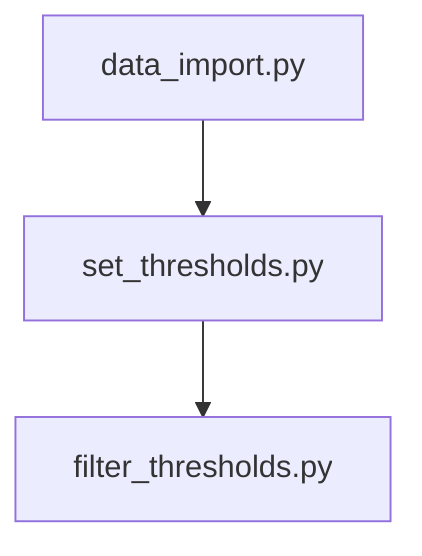

# mercer_mobility

a repo to automate download and analysis of data for mercer county

## analysis runs

## TODO

:white_check_mark: import data scripts

:white_check_mark: set thresholds

:white_check_mark: clip to mercer roads

:white_check_mark: add pm model vols and segment crash data

:white_check_mark: refactor/create shapefile import script

:black_square_button: conflate to target road network
